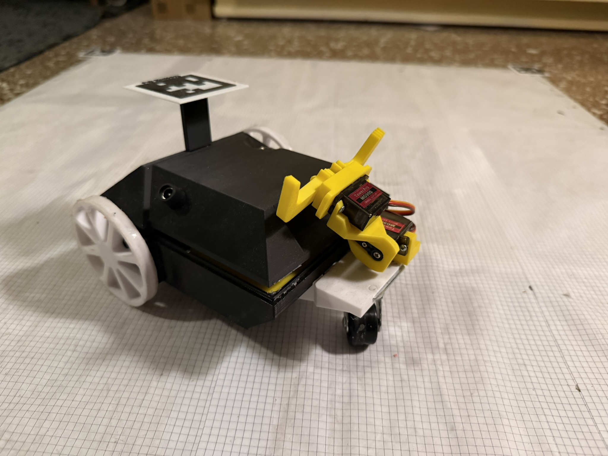
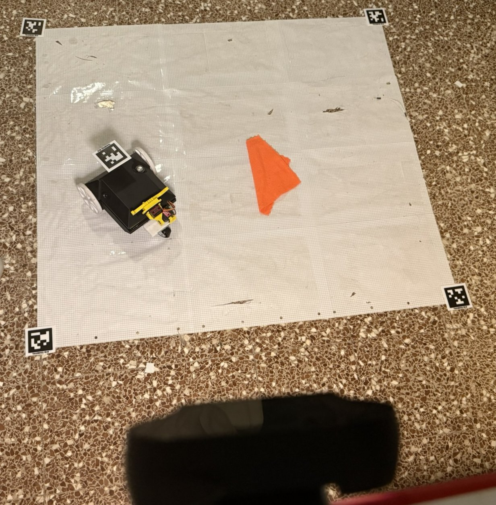
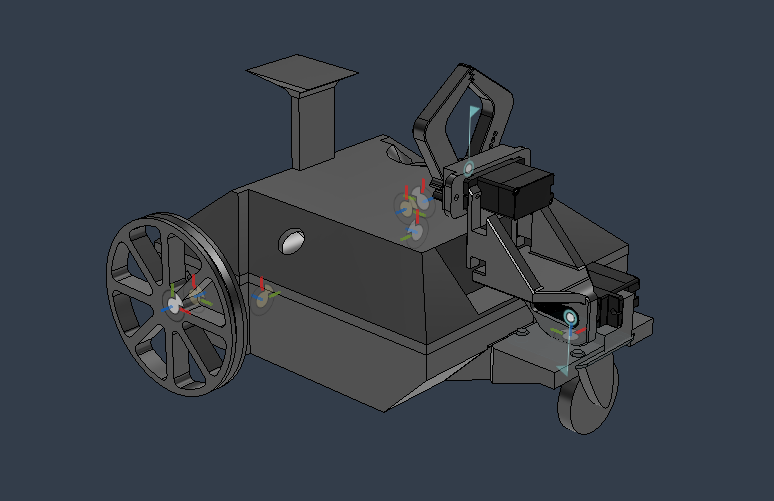
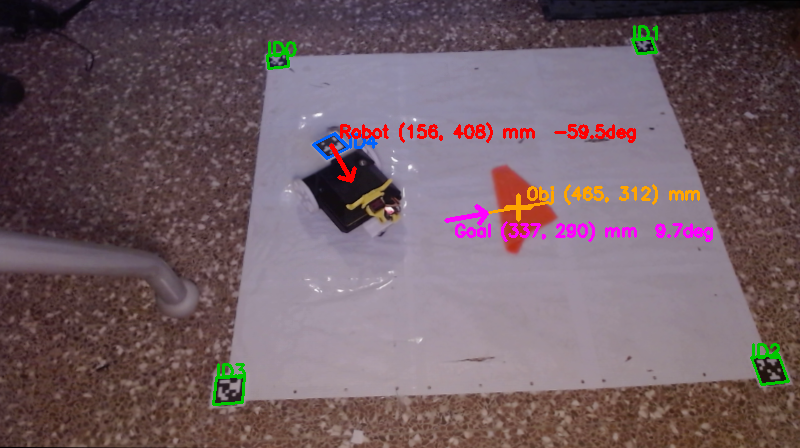
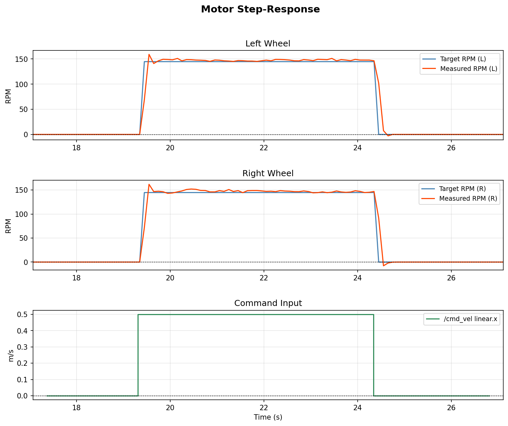
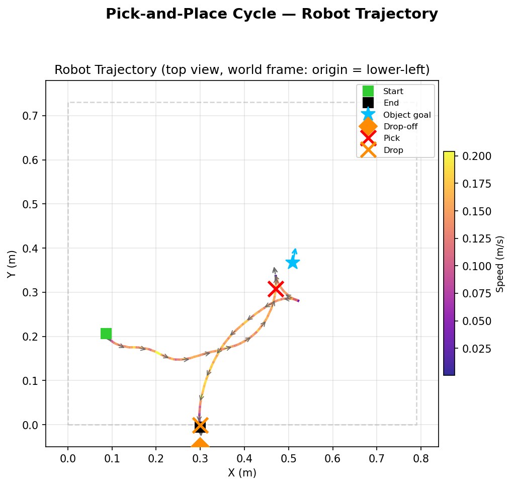

# MicroROS ESP32 Pick-and-Place Robot

A differential-drive robot that autonomously locates a red object in a flat workspace, drives to it, picks it up with a gripper, and drops it at a fixed target — all guided by a ceiling-mounted camera and AprilTag pose estimation.

<p align="center">
  
</p>

---

## System Overview

The system is split across three tiers that communicate over ROS 2:

| Tier | Technology | Role |
|------|-----------|------|
| **ESP32 firmware** | micro-ROS / FreeRTOS | Hard real-time motor PI control, encoder sampling, servo PWM |
| **PC Python nodes** | ROS 2 / OpenCV | Vision pipeline, pose estimation, trajectory regulation |
| **MATLAB / Simulink** | Stateflow | High-level pick-and-place state machine |

```
 Simulink ──/target_pose──▶ Python ──/cmd_vel──▶ ESP32
 Simulink ◀─/object_stable─ Python ◀─/motor_debug─ ESP32
 Simulink ──/pickup srv──▶ Python ──/servo/cmd──▶ ESP32
```

The micro-ROS Agent bridges WiFi UDP ↔ DDS between the ESP32 and the PC ROS 2 network.

---

## Workspace Setup

<p align="center">
  
</p>

Four AprilTag corners (IDs 0–3) are taped to a 790 × 730 mm mat and define the workspace coordinate frame via homography. The robot carries AprilTag ID 4 on top for full pose estimation.

---

## Hardware

<p align="center">
  
</p>

| Component | Detail |
|-----------|--------|
| MCU | RYMCU ESP32 DevKitC |
| Motor driver | 2× DRV8833 |
| Motors | DC with quadrature encoders (420 counts/rev) |
| Servos | 2× hobby servo (gripper + wrist) |
| Camera | USB, ceiling-mounted |
| Wheel radius | 33 mm |
| Wheel base | 160 mm |

### ESP32 Pin Map

| Signal | GPIO |
|--------|------|
| Right motor IN1 / IN2 | 26 / 25 |
| Left motor IN1 / IN2 | 14 / 27 |
| DRV8833 SLEEP | 4 |
| Right encoder A / B | 18 / 19 |
| Left encoder A / B | 23 / 22 |
| Servo 1 (gripper) | 32 |
| Servo 2 (wrist) | 33 |

---

## Vision Pipeline

`workspace_tracker.py` runs OpenCV on the USB camera feed to detect the robot pose and the red object goal in real time.

<p align="center">
  
</p>

- **Robot pose**: AprilTag ID 4 → ray-plane intersection at 115 mm height + `cv2.solvePnP` for yaw
- **Object detection**: HSV red mask (hue 0–10 ∪ 170–180), `minAreaRect`, approach pose set 130 mm from blob centroid along short axis
- **Stability gate**: 15 consecutive frames within ±15 mm and ±0.1 rad before signalling Simulink

---

## Control

### Motor PI loop — ESP32 (20 ms, Core 1)

Feed-forward + PI with ramp limiting and integral windup protection:

```
ramped_target += clamp(RAMP_RATE, target - ramped_target)
error          = ramped_target - rpm_filtered
integral      += error * dt   (clamped)
pwm            = KF * ramped_target + KP * error + KI * integral
```

Default gains: `KP = 3.0`, `KI = 1.0`, `KF = 0.9` — live-tunable via `/pid_gains`. Watchdog zeros targets if no `/cmd_vel` for 2 s.

<p align="center">
  
</p>

### Polar posture regulator — PC Python (20 Hz)

`camera_controller_node.py` runs a polar posture regulator to drive the robot to goal poses:

```
rho   = distance to goal
alpha = bearing of goal in robot frame
beta  = final-heading error

v = K1 * rho * cos(alpha)          # K1 = 1.0
w = K2 * alpha + K1 * sin(alpha) * cos(alpha) * (alpha + K3 * beta) / alpha
                                    # K2 = 2.0, K3 = 4.0
```

Saturations: `v_max = 0.1 m/s`, `ω_max = 1.5 rad/s`. Goal tolerance: 50 mm / 0.1 rad.

---

## Pick-and-Place Trajectory

<p align="center">
  
</p>

The Simulink Stateflow chart (`FSM.slx`) orchestrates the six-state cycle:

```
IDLE → STABILIZING → MOVING_TO_OBJECT → PICKING_UP → MOVING_TO_DROPOFF → DROPPING → IDLE
```

Drop-off pose is fixed at `(x = 0.30 m, y = −0.05 m, yaw = −π/2)`.

---

## ROS 2 Topic Map

| Topic | Type | Direction | Purpose |
|-------|------|-----------|---------|
| `/cmd_vel` | `geometry_msgs/Twist` | PC → ESP32 | Velocity commands |
| `/servo/cmd` | `std_msgs/Float32MultiArray` | PC → ESP32 | `[servo1_deg, servo2_deg]` |
| `/pid_gains` | `std_msgs/Float32MultiArray` | PC → ESP32 | Live gain update `[KP, KI, KF]` |
| `/motor_debug` | `std_msgs/Float32MultiArray` | ESP32 → PC | `[rpm_R, target_R, rpm_L, target_L, ...]` at 10 Hz |
| `/robot_pose` | `geometry_msgs/PoseStamped` | PC → PC | Robot pose from AprilTag |
| `/object_goal` | `geometry_msgs/PoseStamped` | PC → PC | Red object approach pose |
| `/object_stable` | `std_msgs/Bool` | PC → Simulink | Object stationary flag |
| `/motion_active` | `std_msgs/Bool` | PC → Simulink | Trajectory running flag |
| `/target_pose` | `geometry_msgs/PoseStamped` | Simulink → PC | Goal for regulator |
| `/start_motion` | `std_srvs/Trigger` | Simulink → PC | Begin regulation |
| `/pickup` / `/drop` | `std_srvs/Trigger` | Simulink → PC | Gripper sequences |

---

## Dependencies

**PC (Ubuntu + ROS 2 Jazzy)**
```bash
pip install opencv-python pupil-apriltags numpy
sudo apt install ros-jazzy-micro-ros-agent
```

**ESP32 firmware** — PlatformIO with the micro-ROS Arduino library (configured in `microROS_bot/platformio.ini`).

---

## Quick Start

### 1. Configure WiFi

Edit `microROS_bot/lib/ros_communication/ros_communication.cpp` and set your network credentials and agent IP:

```cpp
const char* WIFI_SSID     = "YOUR_SSID";
const char* WIFI_PASSWORD = "YOUR_PASSWORD";
const IPAddress AGENT_IP(192, 168, x, x);
```

### 2. Flash the firmware

```bash
cd microROS_bot
pio run -t upload
pio device monitor   # verify WiFi + agent connection
```

### 3. Launch the PC stack

```bash
# One-shot launcher — opens 7 terminals
./kickstart.zsh --camera 0
```

Or manually in order:

```bash
# Terminal 1 — micro-ROS bridge
ros2 run micro_ros_agent micro_ros_agent udp4 --port 8888

# Terminal 2 — vision
python3 workspace_tracker.py --camera 0

# Terminal 3 — trajectory + services
python3 camera_controller_node.py --camera 0
```

### 4. Start the state machine

Open `FSM.slx` in MATLAB/Simulink, connect in **External mode** (ROS Domain ID = 0), and toggle the `run_enable` block to begin the pick-and-place cycle.

---

## Repository Structure

```
├── microROS_bot/                  # ESP32 PlatformIO project
│   ├── src/main.cpp               # Dual-core task setup
│   └── lib/
│       ├── motor_control/         # PI loop, encoder ISRs, PWM
│       ├── ros_communication/     # micro-ROS subscriptions + publishers
│       └── shared_state/          # Shared variables (gains, wheel params)
├── workspace_tracker.py           # Vision node (AprilTag + HSV detection)
├── camera_controller_node.py      # Trajectory regulator + service servers
├── FSM.slx                        # Simulink Stateflow state machine
├── +bus_conv_fcns/                # Auto-generated ROS 2 bus converters
├── kickstart.zsh                  # Full-stack launcher
└── pictures/                      # Reference images
```
